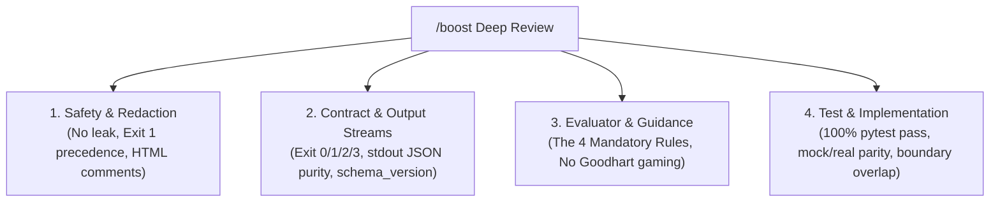

# Code Review Skill for `typesafe-eval`

This skill defines the standardized, rigorous code review process for the `typesafe-eval` codebase. Because `typesafe-eval` serves as an evaluation gatekeeper and safety boundary for AI coding agents and CI workflows, code reviews must be executed with extreme diligence.

Reviewers must use the **/boost** mindset—engaging deep investigation, multi-perspective verification, and adversarial analysis to detect subtle bugs, contract breaches, and security regressions.

---

## The 4 Review Pillars

Every review must inspect changes against these four non-negotiable architectural pillars:



### Pillar 1: Safety & Sensitive Data Redaction
- **Zero Leakage**: Raw credentials (AWS keys, tokens, passwords, private keys) and personal email addresses MUST NEVER appear in `stdout`, JSON output, logs, or error messages. Only placeholders (`[SECRET_1]`, `[EMAIL_1]`) or masked tokens are permitted.
- **Precedence Rule (1 over 3)**: If a run encounters both a safety/content violation and a runtime/network error, the CLI must return **Exit Code 1**, never 3. Safety violations cannot be masked by runtime faults.
- **HTML Comment Processing**: Sensitive data detection and masking must occur across the entire document (including inside `<!-- ... -->`) before comments are stripped from the prompt sent to the LLM.

### Pillar 2: Contract & Output Stream Separation
- **Deterministic Exit Codes**:
  - `0`: All documents passed gates, or clean dry-run.
  - `1`: Content / safety gate violation.
  - `2`: CLI usage, bad arguments, or config syntax error.
  - `3`: Runtime error, network timeout, or missing `TYPESAFE_API_KEY`.
- **Stream Purity**:
  - `stdout`: Pure JSON stream when `--format json` is requested (must remain parseable by `jq`).
  - `stderr`: Warnings, file read errors, and diagnostics belong strictly on `stderr`.
- **JSON Schema Version**: Verify `schema_version: "1.0"` is present on `DocumentEvalResult` and `ValidationReport`.

### Pillar 3: Evaluator Integrity & The 4 Mandatory Rules
- **Rule 1: Don't make scores a loop target**: Automated agent loops must be capped at 2 rounds. Reviewers must reject changes that encourage gaming evaluator scores or stripping legitimate content to force a pass.
- **Rule 2: Language caveat**: System One (Jev) is calibrated for English. Japanese or multilingual text must report appropriate confidence cautions.
- **Rule 3: Near-threshold softness**: Questions within ±0.10 of decision boundary are soft; report probability ranges rather than binary pass/fail.
- **Rule 4: Never pass API keys through prompts/agents**: Credentials must be read directly from the environment.
- **Chunking & Unplaced Tokens**: Raw values spanning chunk boundaries (2000 char overlap) must be handled; unplaced warnings must be reported in `--no-mask`, and masked unplaced placeholders must trigger runtime errors.

### Pillar 4: Test & Implementation Rigor
- **100% Test Pass Rate**: Full test suite must pass (`.venv/bin/pytest -v`).
- **Mock vs. Real Parity**: Ensure `_build_mock_result` mirrors live evaluation logic (including regexes and placeholder parsing).
- **Type Annotations**: Python code must have strict typing compatible with Python 3.10–3.14.

---

## Step-by-Step Review Procedure

### Step 1: Collect Scope and Git Diff
1. Run `git diff HEAD~1` (or compare branch against `main`).
2. List all modified and newly added files.
3. Identify which components are affected:
   - Evaluator core (`src/typesafe_eval/client.py`)
   - Sanitizer & detection regexes (`src/typesafe_eval/sanitizer.py`)
   - CLI & presentation (`src/typesafe_eval/cli.py`, `src/typesafe_eval/reporter.py`)
   - Validation & corpus (`src/typesafe_eval/validator.py`, `validation/corpus/`)
   - Integrations (`skills/`, `hooks/`, `action.yml`, `.pre-commit-hooks.yaml`, `AGENTS.md`)

### Step 2: Execute `/boost` Multi-Perspective Deep Inspection
Engage the `/boost` review routine by scrutinizing the changes across the four pillars:
- Read [references/checklist.md](./references/checklist.md) for domain-specific checks.
- Think adversarially:
  - *What happens if `TYPESAFE_API_KEY` is missing?*
  - *What happens on an untrusted fork PR?*
  - *What happens if a markdown file has Windows CRLF or unusual UTF-8 characters?*
  - *What happens if an HTML comment has unclosed tags or nested brackets?*
  - *Does any new exception bypass the exit code contract?*

### Step 3: Run Automated Verification
Execute the test suite and verify linting:
```bash
.venv/bin/pytest -v
```
Check that test execution is fast (< 3s) and no warnings or unhandled exceptions are emitted.

### Step 4: Construct the Review Report
Synthesize your findings into a clear, actionable review report following this format:

```markdown
### Code Review Summary

#### 1. Pillar Assessment
- **Pillar 1 (Safety & Redaction)**: [PASS / FAIL] — Explanation
- **Pillar 2 (Contract & Output Streams)**: [PASS / FAIL] — Explanation
- **Pillar 3 (Evaluator & Guidance Rules)**: [PASS / FAIL] — Explanation
- **Pillar 4 (Test Coverage & Parity)**: [PASS / FAIL] — Explanation

#### 2. Detailed Findings
- `[BLOCKER|WARNING|SUGGESTION]` **<file_path>:<line_number>**: Description of the issue, risk, and concrete recommendation.

#### 3. Verdict
VERDICT: APPROVED | CHANGES_REQUESTED
```
